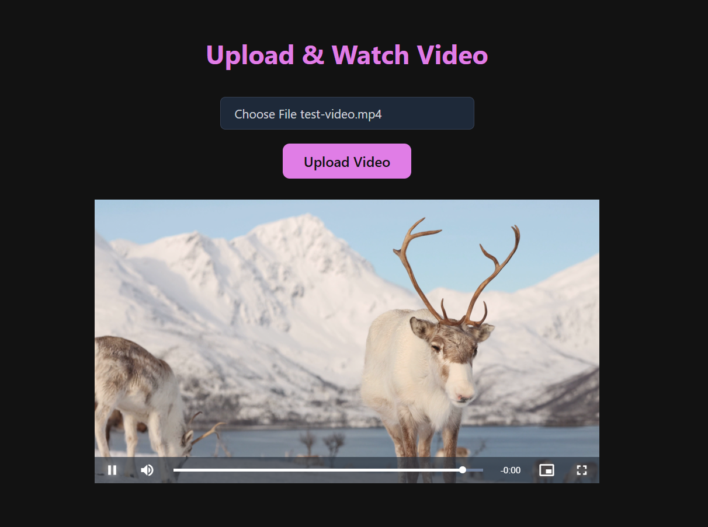

## Video Streaming (HLS) Application 🎬

This project is a video upload and streaming application built using Node.js, Express and React. It utilizes FFmpeg to convert uploaded videos into HLS (HTTP Live Streaming) format. FFmpeg processes the video by encoding it with libx264 for video and AAC for audio, segmenting it into .ts files, and generating an .m3u8 playlist. 

## Preview

## API Endpoints

Method | Endpoint | Description
--- | --- | ---
POST | `/api/v1/videos/upload` | Upload a video
GET | `/api/v1/videos/latest` | Get the latest uploaded video ID
GET | `/api/v1/videos/:id` | Get the video URL by ID